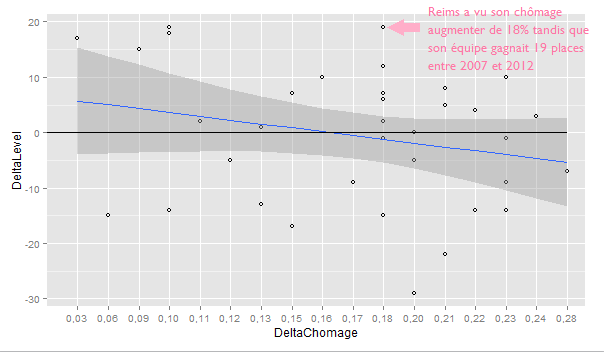

Il est des jours bénis où les sujets d’article vous tombent dessus en consultant d’un oeil distrait les dernières nouvelles de votre sport préféré.

“Nous n’avons pas mené à ce jour d’études pour mesurer [l’]impact économique [du club sur la ville de Nice]. Mais l’OGC Nice joue un rôle de locomotive évident.” C’est en lisant cette [affirmation](https://web.archive.org/web/20150923162718/http://www.ecofoot.fr/interview-exclusive-gilles-veissiere-mairie-nice/) de Gilles Veissière, adjoint au Maire délégué aux Sports de la ville de Nice, que nous avons eu l’idée de faire une étude d’impact simple.

Spoiler alert : l’existence d’un tel impact est incertain.

Etudier l'impact économique des clubs : quel intérêt ?
---

De nombreuses villes investissent dans la construction de nouveaux stades, à l’instar de la ville de Nice et son nouveau stade Allianz Riviera. Construit pour 225 millions sur 30 ans d’après Christian Estrosi - ou plutôt le double d’après la [cour régionale des comptes](http://latta.blog.lemonde.fr/2015/07/10/le-stade-de-nice-une-farce-couteuse-aux-depens-de-la-ville/), le stade de Nice est loin d’être un cas isolé.

Avec la tenue de l’Euro 2016 en France, nombreuses sont les villes qui se dotent de nouveaux stades, comme Bordeaux, Lille ou Lyon. Des stades qui coûtent cher aux contribuables et dont on ne connait pas, au-delà des promesses, l’impact sur l’économie locale. 

Recette pour une étude d’impact “maison”
---

Nous avons donc choisi d’étudier l’impact du niveau d’un club professionnel sur la santé économique de son territoire.

La première question que nous nous sommes posée a été celle des indicateurs. Il fallait que ceux-ci soient faciles d’accès (publics), gratuits et représentatifs du phénomène que nous entendions étudier.

### Quels ingrédients ? Les indicateurs de la santé économique

La santé économique locale est un phénomène complexe, qu’on ne peut pas réduire à un seul indicateur consacré. Conscients de ceci, nous avons eu la tentation de multiplier la [liste des indicateurs](http://www.insee.fr/fr/bases-de-donnees/default.asp?page=statistiques-locales/donnees-detaillees_tableau.htm) à étudier. Mais une analyse de données ne peut se faire sans les données elles-mêmes. 

**Le choix du territoire à étudier**

Mon choix s’est porté sur les  “zones d’emploi”. Sous ce nom peu commun se cache en réalité qu’un “espace géographique à l'intérieur duquel la plupart des actifs résident et travaillent, et dans lequel les établissements peuvent trouver l'essentiel de la main d'œuvre nécessaire pour occuper les emplois offerts” (INSEE). La zone d’emploi rassemble ainsi souvent une ville et sa banlieue. Ce découpage est celui qui m’est apparu le plus pertinent pour notre analyse, puisqu’elle inclut les personnes qui travaillent en ville mais habitent en banlieue, contrairement au découpage “ville”. Néanmois son caractère récent m’empêche d’utiliser certains indicateurs, comme le taux de pauvreté, dont les données antérieures à 2012 ne sont pas encore disponibles pour les zones d’emploi. 

**Le choix de la période à étudier**

Là encore, la tentation est grande de choisir d’emblée une période de temps très longue. Toutes les données de 2012 étaient présentes en accès libre sur le site de l’INSEE. L’obtention des données historiques a nécessité de les contacter. Après une discussion rapide et efficace avec leur service presse, la plupart des données demandées m’ont été envoyées pour l’année 2007. Certains indicateurs, comme la population par zone d’emploi par exemple, ne sont disponibles que tous les 5 ans, lorsqu’un recensement est conduit. Remonter 2007 pose problème dans la mesure où les définitions des découpages et des indicateurs ont changé. 

*Là, tout n'est qu'ordre et beauté*

Pour toutes ces raisons, nous avons choisi d’étudier 36 clubs soit la quasi-intégralité des clubs des deux premières ligues françaises grâce à deux indicateurs entre 2007 et 2012.

Le premier indicateur est le taux de chômage. C’est un indicateur usuel de la santé économique d’un territoire.

Le second indicateur est la variation de la population due au solde apparent des entrées-sorties. Un nom barbare pour exprimer une chose simple : l’évolution de la population d’un territoire lorsque l’on retire la part due à la natalité et à la mortalité. C’est excellent indice de l’attractivité d’un territoire, puisqu’il met en avant les arrivées ou les départs a priori voulus par les individus.

Certaines villes, comme Bastia, comportent plusieurs clubs qui ont été en Ligue 1 et en Ligue 2 entre 2007 et 2012. Nous avons choisi de retirer ces rares clubs de l’étude pour ne pas la biaiser.

### Quels ingrédients ? Les indicateurs du niveau des clubs

Bonheur, la meilleure mesure s’avère dans ce cas-ci être la plus simple d’accès. Le classement en fin de saison est une mesure dont la définition est claire (un club est ou n’est pas premier de sa ligue) et est disponible gratuitement sur des [sites spécialisés](http://eu-football.info/) ou sur [Wikipedia](https://fr.wikipedia.org/wiki/Championnat_de_France_de_football_de_Ligue_2_2012-2013). 

*Wikipedia ou la caverne d’Ali Data*

### Quels ustensiles ?

Google spreadsheet est un outil extrêmement utile lorsqu’il s’agit de faire de rapides analyses sur les données. Mais pour faire une analyse statistique, il m’a fallu utiliser un script R. 

*Much R, such waouh*   

Pour tenter de trouver une corrélation entre le niveau d’un club de foot professionnel et la santé économique locale, il ne suffit pas de trouver une tendance, qui elle pourrait être visible sur un graphique fait via Google Spreadsheets. 

Il faut aussi s’assurer que nos résultats sont “significatifs” à savoir qu’ils sont tellement marqués qu’il n’y a qu’une chance minime que de tels résultats soient le fruit du hasard.

Le résultat va vous étonner
---

Nous n’avons pas trouvé de corrélation significative entre le niveau d’un club de foot et la santé économique de son territoire. 

Sur ce premier graphique, la droite noire représente notre hypothèse de départ : “il n’y a pas de corrélation entre le niveau d’un club et le taux de chômage”. 

La relation trouvée par notre script R est indiquée par la droite bleue. Mais ce n’est pas parce que droite bleue et droite noire ne se confondent pas que cette relation est significative. La probabilité d’obtenir cette relation “au hasard” est de 54,73%, soit bien au-delà du seuil des 5% habituels en statistiques.

La droite bleue représente certes une relation entre ces deux variables, mais cette relation n’est pas assez forte pour pouvoir être significative. En simplifiant : nos points sont tous beaucoup trop éparpillés pour que cette relation ait une quelconque signification. 

*La nuit, tous les charts sont gris*

De même si l’on s’intéresse à la relation entre attractivité d’un territoire au regard des entrées/sorties de sa population et au niveau de son club de foot.

Le statisticien, toujours prudent, ajoutera qu’on ne peut pas prouver l’absence d’une corrélation, mais seulement son existence (remercions à ce sujet Frédéric Schütz, statisticien et excellent conseiller). 

Nous ne pouvons donc pas affirmer que cette corrélation n’existe pas. Néanmoins, avec les données que nous avons étudié, nous pouvons remettre en question le caractère “évident” du “rôle de locomotive” des clubs de foot sur leur territoire local. Une absence d’évidence que certaines villes comme [Strasbourg](http://www.rue89strasbourg.com/index.php/2015/10/01/societe/a-la-meinau-le-stade-avant-le-stade/) avaient déjà pressenti : la ville a ainsi fait le choix de refuser d’investir dans un nouveau stade pour accueillir l’Euro 2016.

###Limites 

Mesurer un phénomène, c’est montrer la réalité sous un prisme particulier défini par des critères précis. Les chiffres ne sont en rien une vérité objective, mais seulement une image partielle de la réalité selon une certaine définition.

En choisissant les indicateurs de santé économique, nous avons donc dû combiner plusieurs indicateurs imparfaits.
Le taux de chômage par exemple ne pas en compte les chômeurs radiés du Pôle Emploi.

De même, la variation de la population due au solde apparent des entrées-sorties peut être due en partie à d’autres mouvements que des mouvements voulus.